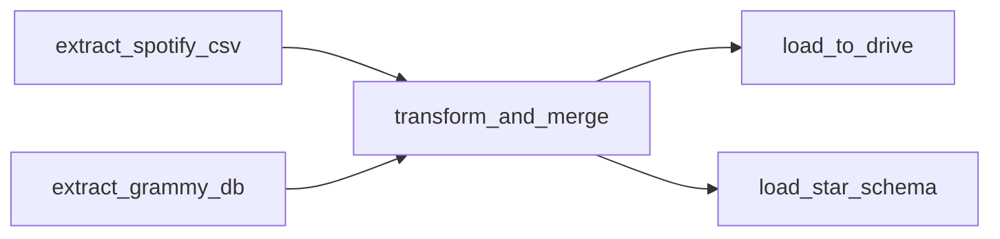

# ETL with Airflow

## 1) Objective

Build an **ETL** pipeline orchestrated with **Apache Airflow** that:

* Extracts Spotify (CSV) and Grammys (DB).
* Cleans, normalizes, and **merges** both datasets.
* Exports the result to **Google Drive** (CSV).
* Loads a **star schema** in MySQL for analytics and dashboarding.

---

## 2) Project Structure

```
AIRFLOW/
│
├── dags/                          # Main folder for Airflow DAGs
│   ├── __pycache__/               
│   ├── data/                      # Internal folder for data generated inside the DAG
│   │   └── spotify_grammy_full.csv     # Final CSV produced after transformation and merge
│   │
│   ├── etl_pipeline.py            # Main DAG with all ETL tasks
│   ├── get_token.py               # Helper script to obtain Google Drive credentials
│   ├── credentials.json           # Google Drive API OAuth credentials
│   └── token.json                 # Auth token generated after authorizing Google Drive
│
├── data/                          # Original datasets
│   ├── spotify_dataset.csv             # Original Spotify dataset
│   └── the_grammy_awards.csv           # Original Grammy dataset
│
├── logs/                          # Logs generated by DAG runs
│
├── plugins/                       # Reserved for future custom plugins or hooks
│
├── EDA.ipynb                      # Exploratory Data Analysis notebook
├── load_raw_grammy.py             # Script to load Grammy data into MySQL
├── docker-compose.yaml            # Airflow Docker environment configuration
├── requirements.txt               # Project dependencies (rapidfuzz, pydrive2, etc.)
└── .env                           # Local environment variables (connections, keys, etc.)
```

---

## 3) DAG Design (Airflow)

**DAG:** `etl_pipeline` (daily, no catchup)

**Tasks and dependencies:**



---

## DAG `etl_pipeline` Overview

The **`etl_pipeline`** DAG orchestrates the end-to-end process of extracting, transforming, and loading **Spotify** and **Grammy** data within an **Apache Airflow**-controlled environment. Its purpose is to automate the integration of both sources, apply cleaning and fuzzy-matching transformations, and finally load the resulting information into a star-schema database for downstream analysis.

This flow runs daily (`@daily`), without backfilling (`catchup=False`), and with a single active run (`max_active_runs=1`), ensuring stability during loads. The pipeline relies on two Airflow connections: `mysql_local`, which accesses the source table `grammy_awards`, and `mysql_dw`, which connects to the destination data warehouse.

In brief, the DAG follows this sequence:

1. **Extract original data** from Spotify (local CSV) and from the Grammys (MySQL database).
2. **Transform and merge** both sources with cleaning, normalization, and fuzzy matching to identify nominated songs.
3. **Export the consolidated dataset** to a CSV and automatically upload it to Google Drive.
4. **Load final data** into a MySQL star schema to facilitate analysis and visualization.

DAG tasks:

### `extract_spotify_csv`

Reads the `spotify_dataset.csv` file located at `/opt/airflow/data/` and converts it to JSON for inter-task transfer.

### `extract_grammy_db`

Creates a local connection with `mysql_local` using the Airflow hook. Runs a SQL query on the `grammy_awards` table to retrieve all nomination data. Converts results to JSON.

### `transform_and_merge`

This stage cleans, normalizes, and aligns both data sources.

For Spotify:

* Remove helper column `Unnamed: 0` if present.
* Drop non-required columns: `key`, `mode`, `time_signature`, `winner`.
* Remove rows with nulls and strict duplicates.
* Normalize genres: map **sub-genres** into **main buckets** (e.g., *alt-rock → rock*, *deep-house → electronic*, *k-pop → pop*, etc.).
* Create `sub_genre` (original) and `main_genre` (mapped). Drop `track_genre`.
* **Deduplicate by `track_id`:** keep the record with highest `popularity` and concatenate secondary sub-genres into `sub_genre`.
* Convert `duration_ms` to **minutes** → `duration_min`.
* Cap `loudness` at `≤ 0` (fix anomalous positive values).
* Standardize text in `artists`, `album_name`, `track_name` (lowercase, trim).
* Consolidate by `(track_name, artists)` keeping the most popular and listing the others in `album_others` to preserve dimensionality.

For Grammys (CSV/DB):

* Remove fields not needed for this focus: `winner`, `workers`, `img`, `published_at`, `updated_at`.
* Normalize text in `title`, `category`, `nominee`, `artist`.
* Fill missing `nominee`/`artist` with `not specified`.

Spotify ↔ Grammys matching:

* Prepare key fields to ensure robust comparisons. For artists, build lists of “clean” names by removing accents/special chars, lowercasing, and replacing connectors like “feat.”, “featuring”, “&”, or commas with a single separator `;`. This makes collaborations written differently (“Beyoncé feat. Jay-Z” vs. “Jay Z & Beyoncé”) comparable.
* Create a flag `is_various_artists` to identify Grammy records that correspond to compilations.
* Perform an **outer join** between Spotify `track_name` and Grammy `nominee` to keep all potential pairs even with minor title differences.
* Apply **fuzzy matching** with **RapidFuzz** on top of the merged results:

  * Compare titles using `token_set_ratio` with a **90%** threshold.
  * Then compare artists:

    * If `is_various_artists=True`, require the Spotify side to have **more than one artist**.
    * Otherwise, consider a match if **at least one pair** of artists surpasses the same 90% threshold.
* When both conditions are met (title + artist), set **`grammy_nominee=True`**.
* After matching, adjust dtypes and fill missing values:

  * `explicit` → boolean, default `False`.
  * Empty strings in text columns → `"not specified"`.
  * Numeric nulls → `0` to avoid star-schema load errors.
* Rename columns to distinguish origin (e.g., `artist_spotify`, `artist_grammy`) and order them logically (Spotify first, then Grammy, then auxiliaries). The result is a **consolidated CSV** saved at `OUT_PATH`, used as the main product of the transformation stage and as input to subsequent stages.

### `load_to_drive`

Once the final file is generated, this task uploads it to **Google Drive** using the official API. It uses `credentials.json` and `token.json` to authenticate, refreshing the token if needed. The file is stored in the configured folder by its Drive ID.

### `load_star_schema`

Builds and populates the **star schema** in the database connected as `mysql_dw`. It creates dimension tables for tracks, artists, albums, genres, time, and nominations, plus a fact table with musical metrics and the nomination flag.

---

## 4) ETL Pipeline 

### 4.1 Extraction

* **Spotify (CSV)**
  Read local file and return as JSON to pass between tasks.

* **Grammys (DB)**
  Run `SELECT * FROM grammy_awards;` with `MySqlHook(mysql_local)` and return JSON.

### 4.2 Transformation and Merge (`transform_and_merge`)

(As detailed above.)

---

## 4.3 Load 

**`load_to_drive`**
Publishes the final ETL artifact (the consolidated CSV) to **Google Drive**. Validates the path, reads the token from `TOKEN_PATH` (refreshing if expired), builds a **Drive API v3** client, defines metadata, and—if `FOLDER_ID` is set—uploads **into that folder**. Upload uses `MediaFileUpload` in resumable mode for resilience.

**`load_star_schema`**
Loads the final dataset into a **MySQL star schema**. Reads the consolidated CSV and normalizes booleans that might arrive as text. Opens the `mysql_dw` connection and executes the DW **DDL**. If `recreate_schema=True`, recreates the schema from scratch (ideal for development). Creates/ensures **dimensions** (`dim_track`, `dim_artist`, `dim_album`, `dim_genre`, `dim_time`, `dim_grammy`). Inserts dimensions with `to_sql`, retrieves surrogate keys, and builds the **`fact_track_metrics`** fact table by joining on natural keys. Casts `explicit` and `grammy_nominee` to `INT` (0/1) and loads in batches (`chunksize=10_000`) for performance.

---

## 5) Star Schema (MySQL)

### Dimension Tables

Dimensions hold descriptive/categorical information, each with its own primary key (`*_key`) used to relate to the fact table:

* **`dim_track`**: basic song info: Spotify ID and track name.
* **`dim_artist`**: all unique artists present in the dataset.
* **`dim_album`**: album names; if a track belongs to several, they are grouped in `album_others`.
* **`dim_genre`**: main genres (`main_genre`) and subgenres (`sub_genre`), deduplicated.
* **`dim_time`**: publication/nomination years to analyze trends over time.
* **`dim_grammy`**: nomination info: title, category, nominee, and associated artist.
  Also includes a **unique key generated with a hash (SHA2)** to prevent duplicated records when texts differ slightly.

### Fact Table

**`fact_track_metrics`** stores numeric values and analysis metrics.
Each record represents a track and its musical attributes, along with a flag indicating whether it was Grammy-nominated.

It contains foreign keys to all dimensions. Main fields:

* **Foreign Keys:** `track_key`, `artist_key`, `album_key`, `genre_key`, `time_key`, `grammy_key`.
* **Numeric metrics:** `popularity`, `duration_min`, `danceability`, `energy`, `loudness`, `valence`, `tempo`, among others.
* **Boolean flags:**

  * `explicit` (0/1 indicating explicit content).
  * `grammy_nominee` (0/1 indicating Grammy nomination).

---

## 6) Assumptions and Key Decisions

* **Main genre vs. subgenre:**
  A genre hierarchy was created to improve analytical consistency. `main_genre` groups similar subgenres (e.g., *alt-rock*, *punk-rock*, *grunge* → *rock*) to enable cross-category comparisons in dashboards. `sub_genre` preserves original detail for deeper analysis. This balances **precision and readability**.

* **Duplicates by `track_id` and (`track_name`, `artists`):**
  Many tracks appeared repeatedly with the same artist but on different albums (remasters, compilations). The decision was to keep **only the most popular version**, as it represents the most relevant to users, and to group by `track_name` and `artists` to avoid multiple hits in the Grammy merge. Remaining albums were concatenated in `album_others`. This ensures each track–artist pair has **a single representation** in the final dataset.

* **Duration and Loudness:**
  Duration was converted from milliseconds to minutes (`duration_min`) for interpretability. Positive `loudness` values were capped to 0, as relative dB are typically non-positive. Both decisions improve **metric coherence and readability**.

* **Text and artist normalization:**
  All text was lowercased, stripped of diacritics, and extra spaces; connectors like “feat.” or “&” were unified under `;`. This ensures artist lists are **comparable and consistent**, avoiding errors during matching.

* **Fuzzy matching (RapidFuzz):**
  To link Spotify tracks with Grammy nominations, **fuzzy matching** was applied with a 90% threshold. Titles were compared (`token_set_ratio ≥ 90`) and artist lists under the same conditions. For “various artists,” the Spotify side was required to have multiple performers. This balances **precision and flexibility**, reducing false positives.

* **Nulls and data types:**
  Missing values were filled with `"not specified"`, `0`, or `False` according to type.

---

## 7) Visualizations and KPIs (Summary)

### Global Project KPIs

These cards summarize key indicators combining Spotify and Grammy information:

| **KPI**                                  | **Description and interpretation**                                                                                                                                                         |
| ---------------------------------------- | ------------------------------------------------------------------------------------------------------------------------------------------------------------------------------------------ |
| **Explicit Rate (8%)**                   | About 8% of analyzed songs contain explicit content. This indicates most of the catalog is suitable for general audiences, reflecting a trend toward broadly distributed commercial music. |
| **Average Popularity (Spotify): 45.64**  | Average popularity is around 45/100, representing a medium visibility level. This suggests a mix of mass hits and niche tracks in the dataset.                                             |
| **Nomination Rate (0.26%)**              | Only 0.26% of songs received a Grammy nomination, showing the Academy’s high selectivity. Fewer than 3 out of every 1,000 songs achieve this distinction.                                  |
| **Average Popularity (Nominees): 60.28** | Nominated songs have significantly higher average popularity than the overall dataset, indicating partial alignment between commercial success and recognition.                            |

---

## Charts and Visual Analysis

### KPI 5: Top 10 Most Popular Artists on Spotify

*(Insert chart image here)*

This chart highlights the artist combinations—either solo or collaborative—with the highest average popularity on Spotify.
As observed, collaborations such as **Sam Smith & Kim Petras**, **Bizarrap & Quevedo**, and **Bad Bunny & Chencho Corleone** approach the maximum popularity score (100).
These cases suggest that joint projects tend to achieve stronger audience impact due to the fusion of styles, shared fan bases, and combined promotional reach.
Meanwhile, individual performers like **Manuel Turizo**, **Harry Styles**, and **Nicki Minaj** also maintain consistently high popularity, confirming their sustained relevance in the streaming landscape.

---

### KPI 6: Grammy Nomination Distribution by Category

*(Insert chart image here)*

The visualization illustrates how Grammy nominations are distributed across award categories.
Among them, **“Record of the Year”** stands out with the highest number of nominations, implying that top-performing songs on streaming platforms often compete in general categories with greater exposure.
Additionally, categories such as **“Best Hard Rock Performance”** and **“Best Metal Performance”** display significant representation, emphasizing the enduring prominence of rock and metal genres within the Grammy framework.
Overall, this chart helps pinpoint the most competitive and visible categories in the award ecosystem.

---

### KPI 7: Grammy Nomination Rate (Success vs. Recognition)

*(Insert chart image here)*

This figure explores the relationship between Spotify popularity and the rate of Grammy nominations by artist.
The scatter plot reveals that there is no strong or direct correlation between both variables, partly due to the limited overlap between datasets.
While some artists achieve high popularity yet few nominations, others gain notable recognition with only moderate commercial success.
Consequently, the results suggest that Grammy prestige is not exclusively linked to popularity metrics, although both dimensions can coincide within certain genres or artists.
In this sense, the visual functions as a comparative KPI, outlining broader patterns between **commercial appeal** and **artistic recognition**.

---

### KPI 8: Popularity Comparison (Nominees vs Non-Nominees by Genre)

*(Insert chart image here)*

In this comparison, average Spotify popularity is analyzed between Grammy-nominated and non-nominated tracks, grouped by primary genre.
Across most categories, nominated songs—represented by dark blue bars—display higher average popularity.
Genres such as **Rock**, **Pop**, **Alternative**, and **Hip-Hop** stand out with the highest overall values, revealing their dominant presence both in streaming platforms and Grammy nominations.
Taken together, these findings indicate a modest but consistent positive association between digital success and critical recognition.

---

### KPI 9: Average Energy vs Average Valence (Valid Years) per Year

*(Insert chart image here)*

Finally, this time-series chart examines the evolution of songs’ sonic characteristics over the decades.
A clear shift can be observed:

* **Early period (1950–1970):** marked by large variations in both energy and valence, reflecting a mix of highly dynamic and more introspective songs.
* **Middle period (1980–2000):** energy stabilizes at medium–high levels, while valence gradually declines, suggesting a move toward intense yet less cheerful compositions.
* **Recent period (2000–2020):** energy remains steady around 0.6, but valence continues to decrease, pointing to a modern preference for powerful sounds with more serious or nostalgic tones.

Overall, this evolution shows that while contemporary music has preserved its rhythmic drive, it has gradually lost some of its emotional brightness.

Dashboard link in Power BI: [https://app.powerbi.com/links/xWjrXR5OFW?ctid=693cbea0-4ef9-4254-8977-76e05cb5f556&pbi_source=linkShare](https://app.powerbi.com/links/xWjrXR5OFW?ctid=693cbea0-4ef9-4254-8977-76e05cb5f556&pbi_source=linkShare)

---

## 8) Setup and Run Instructions

This section explains how to install, configure, and run the ETL pipeline with **Apache Airflow**, **Docker**, and **MySQL**, and how to connect **Google Drive** authentication for automatic CSV upload.

### 1. Prerequisites

Install:

* **Docker Desktop** (with Docker Compose)
* **Python 3.9+** (only if you plan to generate the Google Drive token outside the container)
* **Git** (to clone the repository)
* **MySQL** locally or as an external service (for the Data Warehouse)

### 2. Clone the repository

```bash
git clone https://github.com/Mariana-Cifuentes/Workshop2.git
cd AIRFLOW
```

Keep this folder structure (already mapped in container volumes):

```
AIRFLOW/
├── dags/
│   ├── etl_pipeline.py
│   ├── get_token.py
│   ├── credentials.json
│   ├── token.json
│   └── data/
│       └── spotify_grammy_full.csv  ← generated when running the DAG
├── data/
│   ├── spotify_dataset.csv
│   └── the_grammy_awards.csv
├── docker-compose.yaml
└── requirements.txt
```

---

### 3. Configure Google Drive Credentials

To allow Airflow to upload the final file to Google Drive, you must create a Google Cloud project, enable the Drive API, and generate OAuth credentials.

#### Step 1: Create a project in Google Cloud Console

1. Go to [https://console.cloud.google.com](https://console.cloud.google.com) and sign in with your Google account.
2. Top-left: **“Select project” → “New project.”**
3. Name it, e.g., `airflow-drive-uploader`.
4. Wait until the project is created and selected.

#### Step 2: Enable the Google Drive API

1. In the project, open the left menu:
   **“APIs & Services → Library.”**
2. Search **Google Drive API**.
3. Open it and click **“Enable.”**

#### Step 3: Create OAuth credentials

1. Left menu: **“APIs & Services → Credentials.”**
2. Click **“+ Create credentials” → “OAuth client ID.”**
3. If prompted, configure the consent screen: choose **“External”** and complete the minimal fields (only the app name is required).
4. Create the OAuth client with:

   * **Application type:** Desktop app
   * **Name:** Airflow Drive ETL (or any descriptive name)
5. Download the JSON with your credentials.

#### Step 4: Save `credentials.json` and generate the token

1. Rename the downloaded file to **`credentials.json`** and place it in:

   ```
   AIRFLOW/dags/credentials.json
   ```

2. On your local machine, run:

   ```bash
   cd dags
   python get_token.py
   ```

3. A browser window will request access to your Google account. After authorization, a **`token.json`** file will be created in the same folder.

4. In your DAG (`etl_pipeline.py`), set:

   ```python
   TOKEN_PATH = "/opt/airflow/dags/token.json"
   FOLDER_ID  = "YOUR_FOLDER_ID_HERE"
   ```

---

### 4. Build and Start Airflow with Docker

Your `docker-compose.yaml` already includes all required services (webserver, scheduler, worker, redis, postgres, etc.).

From the project root (`AIRFLOW/`), run:

```bash
docker compose up airflow-init
docker compose up -d
```

This initializes Airflow, creates the admin user, and starts the environment at **[http://localhost:8080](http://localhost:8080)**.

Tip: verify running containers with:

```bash
docker ps
```

---

### 5. Create the `grammy_awards` Database and Load Raw CSV

**Create the database in MySQL Workbench (manual):**

* Open **MySQL Workbench** and connect to your local server.
* Run:

  ```sql
  CREATE DATABASE IF NOT EXISTS grammy_awards
    DEFAULT CHARACTER SET utf8mb4
    COLLATE utf8mb4_unicode_ci;
  ```
* Verify the `grammy_awards` schema exists.

**Run the script from the project root:**

```bash
python load_raw_grammy.py
```

---

### 6. Configure Airflow Connections

1. Start Airflow (as per the step above).
2. Open **[http://localhost:8080](http://localhost:8080)**
   User: `airflow`
   Password: `airflow`
3. Go to **Admin → Connections** and create:

* **MySQL Local (grammy source)**

  * Conn ID: `mysql_local`
  * Conn Type: MySQL
  * Host: `host.docker.internal`
  * Port: `3306`
  * Database: `grammy_awards`
  * Login / Password: your local credentials

* **MySQL Data Warehouse (destination)**

  * Conn ID: `mysql_dw`
  * Conn Type: MySQL
  * Host: `host.docker.internal`
  * Port: `3306`
  * Database: `full_dw`
  * Login / Password: your DW credentials

These connections allow Airflow to read the Grammy data and load the final star model into the DW.

### 6. Run the ETL DAG

1. Open Airflow UI (`http://localhost:8080`).
2. Enable the DAG named **`etl_pipeline`**.
3. Click **Trigger DAG** to run it manually.
4. The pipeline will execute.

When finished:

* The final CSV will be at `/opt/airflow/dags/data/spotify_grammy_full.csv`
* It will also be uploaded to Google Drive (folder defined by `FOLDER_ID`)
* The star schema will be loaded into your `full_dw` database

---

### 7. Verify Results

* In Google Drive: locate **`spotify_grammy_full.csv`**.
* In MySQL: check tables with:

  ```sql
  USE full_dw;
  SHOW TABLES;
  SELECT COUNT(*) FROM fact_track_metrics;
  ```
* In Airflow: open **Graph View** to see the task flow and statuses.

---

### 8. Stop or Restart the Environment

Stop all services:

```bash
docker compose down
```

Clean everything (including volumes and database):

```bash
docker compose down --volumes --remove-orphans
```
