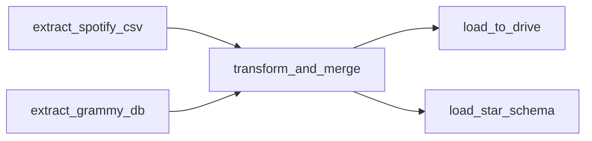

#  ETL con Airflow

## 1) Objetivo

Construir un pipeline **ETL** orquestado con **Apache Airflow** que:

* Extrae Spotify (CSV) y Grammys (DB).
* Limpia, normaliza y **fusiona** ambos datasets.
* Exporta el resultado a **Google Drive** (CSV).
* Carga un **esquema estrella** en MySQL para analítica y dashboarding.

---

## 2) Estructura del proyecto

```
AIRFLOW/
│
├── dags/                          # Carpeta principal donde se almacenan los DAGs de Airflow
│   ├── __pycache__/               
│   ├── data/                      # Carpeta interna para datos generados dentro del DAG
│   │   └── spotify_grammy_full.csv     # Archivo CSV final generado tras la transformación y merge
│   │
│   ├── etl_pipeline.py            # DAG principal con todas las tareas ETL
│   ├── get_token.py               # Script auxiliar para obtener credenciales de Google Drive
│   ├── credentials.json           # Credenciales OAuth de la API de Google Drive
│   └── token.json                 # Token de autenticación generado tras autorizar Google Drive
│
├── data/                          # Carpeta con los datasets originales
│   ├── spotify_dataset.csv             # Dataset original de Spotify
│   └── the_grammy_awards.csv           # Dataset original de los premios Grammy
│
├── logs/                          # Registros generados por las ejecuciones del DAG
│
├── plugins/                       # Carpeta reservada para futuros plugins o hooks personalizados
│
├── EDA.ipynb                      # Notebook de análisis exploratorio (EDA)
├── load_raw_grammy.py             # Script para cargar los datos del Grammy a MySQL
├── docker-compose.yaml            # Configuración del entorno Docker de Airflow
├── requirements.txt               # Dependencias del proyecto (rapidfuzz, pydrive2, etc.)
└── .env                           # Variables de entorno locales (conexiones, claves, etc.)

```

---

## 3) Diseño del DAG (Airflow)

**DAG:** `etl_pipeline` (daily, sin catchup)

**Tareas y dependencias:**


---

## Diseño del DAG `etl_pipeline`

El DAG **`etl_pipeline`** orquesta todo el proceso de extracción, transformación y carga de los datos de **Spotify** y **los premios Grammy** dentro de un entorno controlado por **Apache Airflow**. Su propósito es automatizar la integración de ambas fuentes, aplicar transformaciones de limpieza y emparejamiento difuso, y finalmente cargar la información resultante en una base de datos con un modelo estrella para análisis posterior.

Este flujo se ejecuta de manera diaria (`@daily`), sin ejecuciones acumuladas (`catchup=False`) y con un máximo de una instancia activa a la vez (`max_active_runs=1`), lo que garantiza estabilidad durante la carga. El pipeline se apoya en dos conexiones definidas dentro de Airflow: `mysql_local`, que accede a la tabla de origen `grammy_awards`, y `mysql_dw`, que conecta con el data warehouse destino.

En líneas generales, el DAG sigue esta secuencia:

1. **Extrae los datos originales** de Spotify (desde un archivo CSV local) y de los Grammy (desde una base de datos MySQL).
2. **Transforma y fusiona** ambas fuentes aplicando procesos de limpieza, normalización y coincidencia difusa para identificar canciones nominadas.
3. **Exporta el dataset resultante** a un archivo CSV y lo sube automáticamente a Google Drive.
4. **Carga los datos finales** en un modelo estrella en MySQL para facilitar el análisis y la visualización.

Las tareas que componen el DAG son las siguientes:

### `extract_spotify_csv`

Esta tarea lee el archivo `spotify_dataset.csv` ubicado en `/opt/airflow/data/` y lo convierte en un formato JSON que se transfiere entre tareas.

### `extract_grammy_db`

Aquí se establece una conexión local con la base de datos `mysql_local` utilizando el hook de Airflow. Se ejecuta una consulta SQL sobre la tabla `grammy_awards` para recuperar toda la información de las nominaciones. Los resultados se transforman también a formato JSON.

### `transform_and_merge`

Enesta etapa se limpian, normalizan y alinean ambas fuentes de datos.
Primero, el dataset de Spotify pasa por un proceso de depuración: se eliminan columnas irrelevantes, filas nulas y duplicadas; se ajustan los nombres de géneros musicales para agruparlos en categorías principales; y se corrigen valores anómalos como duraciones o niveles de volumen.
Luego, los datos de los Grammy se normalizan y se preparan para el emparejamiento. El DAG utiliza la librería **RapidFuzz** para comparar títulos y artistas entre ambos conjuntos y detectar coincidencias aun cuando los nombres presenten pequeñas variaciones. El resultado es un nuevo dataset unificado con una columna adicional (`grammy_nominee`) que marca las canciones nominadas. Finalmente, el archivo consolidado se guarda en la ruta `/opt/airflow/dags/data/spotify_grammy_full.csv`, convirtiéndose en el producto principal del proceso.

### `load_to_drive`

Una vez generado el archivo final, esta tarea se encarga de subirlo automáticamente a **Google Drive** mediante la API oficial de Google. Usa las credenciales almacenadas en `credentials.json` y `token.json` para autenticar la sesión, refrescando el token si es necesario. El archivo se guarda en la carpeta configurada mediante su id de drive.

### `load_star_schema`

La última etapa construye y llena el **modelo estrella** dentro de la base de datos conectada como `mysql_dw`. Se crean tablas de dimensiones para pistas, artistas, álbumes, géneros, años y nominaciones, además de una tabla de hechos con métricas musicales y la bandera de nominación.

---

## 4) Pipeline ETL — Explicación de pasos

### 4.1 Extracción

* **Spotify (CSV)**

  * Se lee archivo local y se retorna como JSON para pasar datos entre tareas.
* **Grammys (DB)**

  * Se ejecuta `SELECT * FROM grammy_awards;` con `MySqlHook(mysql_local)` y se retorna JSON.

### 4.2 Transformación y Fusión (`transform_and_merge`)

**Sobre Spotify:**

* Elimina columna auxiliar `Unnamed: 0` si existe.
* Remueve columnas no requeridas: `key`, `mode`, `time_signature`, `winner`.
* Borra filas con nulos y duplicados (estricto para asegurar consistencia).
* Normaliza géneros: mapea **sub-géneros** a **main buckets** (e.g., *alt-rock → rock*, *deep-house → electronic*, *k-pop → pop*, etc.).
* Crea `sub_genre` (original) y `main_genre` (mapeada). Quita `track_genre`.
* **Resolución de duplicados por `track_id`:** conserva el registro con mayor `popularity` y concatena sub-géneros secundarios en `sub_genre`.
* Convierte `duration_ms` a **minutos** → `duration_min`.
* Limita `loudness` a `≤ 0` (corrige valores positivos anómalos).
* Estandariza texto en `artists`, `album_name`, `track_name` (minúsculas, trim).
* Consolida por `(track_name, artists)` conservando el más popular y listando en una nueva columna `album_others` para no perder dimensionalidad.

**Sobre Grammys (CSV/DB):**

* Elimina columnas no útiles para el enfoque: `winner`, `workers`, `img`, `published_at`, `updated_at`.
* Normaliza texto en `title`, `category`, `nominee`, `artist`.
* Llena vacíos en `nominee`/`artist` con `not specified`.

**Emparejamiento Spotify ↔ Grammys:**

* Antes de combinar ambas fuentes, se preparan los campos clave para asegurar comparaciones precisas.
  En el caso de los artistas, se construyen listas de nombres “limpios” eliminando tildes y caracteres especiales, pasando todo a minúsculas y reemplazando conectores como “feat.”, “featuring”, “&” o comas por un único separador `;`.
  Esto permite que colaboraciones escritas de forma diferente (“Beyoncé feat. Jay-Z” vs. “Jay Z & Beyoncé”) sean tratadas como equivalentes.

* Se crea una bandera llamada `is_various_artists` que identifica los registros de los Grammy correspondientes a álbumes o compilaciones con múltiples artistas.

* Una vez normalizados los datos, se realiza un **merge inicial** entre Spotify y Grammy utilizando un *outer join* entre los campos `track_name` (Spotify) y `nominee` (Grammy).
  Este tipo de unión conserva todos los posibles pares de coincidencia, incluso si existen diferencias menores en los nombres.

* Sobre los resultados de ese merge se aplica un proceso de **fuzzy matching** utilizando la librería **RapidFuzz**, con el objetivo de identificar coincidencias aproximadas entre texto.
  Se compara primero el título de la canción mediante el método `token_set_ratio`, que ignora el orden de las palabras y pequeñas variaciones tipográficas.
  Se define un umbral de similitud del **90%** para considerar que los títulos representan la misma obra.
  Luego, se procede con la comparación de artistas:

  * Si el registro de Grammy corresponde a `is_various_artists=True`, se valida únicamente que el lado de Spotify tenga **más de un artista** (ya que representa un conjunto).
  * En los demás casos, se comparan las listas de artistas de ambos lados y se considera coincidencia si **al menos una pareja** supera el mismo umbral del 90%.

* Cuando una fila cumple ambas condiciones —coincidencia de título y coincidencia de artista— se genera la bandera **`grammy_nominee=True`**, indicando que esa canción o álbum de Spotify fue identificado como nominado en los Grammy.

* Después del emparejamiento, se ajustan los tipos de datos y se completan los valores faltantes para mantener la integridad del dataset:

  * `explicit` se convierte a booleano y se rellena con `False` por defecto.
  * Las columnas de texto vacías se reemplazan con `"not specified"`.
  * Los valores numéricos nulos se rellenan con `0` para evitar errores en la carga al modelo estrella.

* Finalmente, se renombran las columnas para distinguir claramente su origen —por ejemplo, `artist_spotify` y `artist_grammy`— y se organizan en un orden lógico (variables de Spotify primero, luego las de Grammy y por último las auxiliares).
  El resultado es un **CSV consolidado** almacenado en `OUT_PATH`, que sirve como producto final de la etapa de transformación y la base para las siguientes fases del pipeline.

---
## 4.3 Carga (outputs)

**`load_to_drive`**
Publica el artefacto final del ETL (el CSV consolidado) en **Google Drive**. Primero valida que la ruta exista; luego lee el token desde `TOKEN_PATH`, refrescándolo si expiró. Con las credenciales activas, construye el cliente de la **Drive API v3**, define metadatos y, si se configuró `FOLDER_ID`, sube el archivo **dentro de esa carpeta**. La subida usa `MediaFileUpload` en modo *resumable* para tolerar microcortes.

**`load_star_schema`**
Carga el dataset final en un **modelo estrella MySQL**. Lee el CSV consolidado y normaliza campos booleanos que pudieran venir como texto. Abre la conexión `mysql_dw` y ejecuta el **DDL** del DW. Si `recreate_schema=True`, recrea el esquema de cero (ideal en desarrollo). Crea/asegura las **dimensiones** (`dim_track`, `dim_artist`, `dim_album`, `dim_genre`, `dim_time`, `dim_grammy`). Inserta las dimensiones con `to_sql`, recupera las *surrogate keys* y construye la **tabla de hechos `fact_track_metrics`** uniendo por claves naturales. Convierte `explicit` y `grammy_nominee` a `INT` (0/1) y hace la carga por lotes (`chunksize=10_000`) para buen rendimiento.

---

## 5) Esquema Estrella (MySQL)

### Tablas de Dimensiones

Las dimensiones contienen información descriptiva o categórica, y cada una tiene su propia clave primaria (`*_key`) que se usa para relacionarse con la tabla de hechos:

* **`dim_track`**: almacena los datos básicos de cada canción: su ID de Spotify y su nombre.
* **`dim_artist`**: lista todos los artistas únicos presentes en el dataset.
* **`dim_album`**: guarda los nombres de los álbumes y, si una canción pertenece a varios, los agrupa en `album_others`.
* **`dim_genre`**: contiene los géneros principales (`main_genre`) y subgéneros (`sub_genre`), sin duplicados.
* **`dim_time`**: almacena los años de publicación o nominación, para analizar tendencias a lo largo del tiempo.
* **`dim_grammy`**: guarda información de las nominaciones: título, categoría, nominado y artista asociado.
  Además, tiene una **clave única generada con un hash (SHA2)** que evita que se repitan registros cuando los textos tienen pequeñas diferencias.

---

### Tabla de Hechos

La tabla **`fact_track_metrics`** almacena los valores numéricos y las métricas de análisis.
Cada registro representa una canción y sus atributos musicales, junto con una marca que indica si fue nominada a los Grammy.

Contiene referencias (`Foreign Keys`) a todas las dimensiones. Sus campos principales son:

* **Claves foráneas:** `track_key`, `artist_key`, `album_key`, `genre_key`, `time_key`, `grammy_key`.
* **Métricas numéricas:** `popularity`, `duration_min`, `danceability`, `energy`, `loudness`, `valence`, `tempo`, entre otras.
* **Banderas booleanas:**

  * `explicit` (0 o 1 según si la canción tiene contenido explícito).
  * `grammy_nominee` (0 o 1 según si fue nominada a un Grammy).

---
## 6) Suposiciones y Decisiones Clave

* **Género principal vs. subgénero:**
  Se creó una jerarquía de géneros para mejorar la consistencia analítica.
  El campo `main_genre` agrupa subgéneros similares (por ejemplo, *alt-rock*, *punk-rock* y *grunge* como *rock*), lo que permite comparar categorías generales en los dashboards.
  El `sub_genre` conserva el detalle original para análisis más específicos. Esta decisión equilibra **precisión y legibilidad**.

* **Duplicados por `track_id` y (`track_name`, `artists`):**
  Muchas canciones aparecían repetidas con el mismo artista pero en diferentes álbumes (como versiones remasterizadas o recopilatorios).
  Se decidió conservar **solo la versión más popular**, ya que representa la más relevante para el usuario, y agrupar por `track_name` y `artists` para evitar múltiples coincidencias en el merge con los Grammy.
  Los álbumes restantes se concatenaron en `album_others`. Esto garantiza que cada canción-artista tenga **una sola representación** en el dataset final.

* **Duración y Loudness:**
  La duración se convirtió de milisegundos a minutos (`duration_min`) para hacerla más comprensible.
  Además, los valores positivos de `loudness` se ajustaron a 0, ya que los decibelios relativos no suelen ser positivos.
  Ambas decisiones mejoran la **interpretabilidad y coherencia de las métricas**.

* **Normalización de texto y artistas:**
  Se pasaron todos los textos a minúsculas, sin tildes ni espacios extra, y se unificaron conectores como “feat.” o “&” bajo un mismo formato `;`.
  Esto asegura que las listas de artistas sean **comparables y consistentes**, evitando errores durante el emparejamiento.

* **Emparejamiento difuso (RapidFuzz):**
  Para vincular correctamente las canciones de Spotify con las nominaciones Grammy, se aplicó un **fuzzy matching** con umbral del 90%.
  Se compararon títulos (`token_set_ratio ≥ 90`) y listas de artistas bajo las mismas condiciones.
  En los casos de “various artists”, se exigió que la canción tuviera varios intérpretes en Spotify.
  Así se equilibró **precisión y flexibilidad**, reduciendo falsos positivos.

* **Nulos y tipos de datos:**
  Los valores faltantes se rellenaron con `"not specified"`, `0` o `False` según el tipo de dato.
  
---

## 7) Visualizaciones y KPIs (Resumen)

*Sección para el dashboard conectado al DW (Power BI / Looker / Tableau):*

* **KPIs sugeridos:**

  * # de **matches** Spotify ↔ Grammys (`grammy_nominee=True`).
  * **Top artistas** por popularidad y/o por nominaciones.
  * **Tendencia anual** de nominaciones vs. popularidad promedio.
* **Gráficas sugeridas:**

  * Barras: nominaciones por **main_genre**.
  * Línea: popularidad media por **año**.
  * Mapa de calor: **correlaciones** entre métricas de audio y bandera `grammy_nominee`.
  * Dispersión: **popularidad vs. tempo/loudness**, coloreado por `grammy_nominee`.

---

## 8) Setup e Instrucciones de Ejecución

Esta sección explica cómo instalar, configurar y ejecutar el pipeline ETL con **Apache Airflow**, **Docker** y **MySQL**, además de cómo conectar la autenticación de **Google Drive** para la carga automática del CSV final.

---

### 1. Requisitos previos

Antes de iniciar, asegúrate de tener instalado:

* **Docker Desktop** (con Docker Compose habilitado)
* **Python 3.9+** (solo si planeas generar el token de Google Drive fuera del contenedor)
* **Git** (para clonar el repositorio)
* **MySQL** instalado localmente o como servicio externo (para el Data Warehouse)

---

### 2. Clonar el repositorio

```bash
git clone https://github.com/<tu_usuario>/<tu_repositorio>.git
cd AIRFLOW
```

Asegúrate de mantener esta estructura de carpetas (ya mapeada en los volúmenes del contenedor):

```
AIRFLOW/
├── dags/
│   ├── etl_pipeline.py
│   ├── get_token.py
│   ├── credentials.json
│   ├── token.json
│   └── data/
│       └── spotify_grammy_full.csv  ← se genera al ejecutar el DAG
├── data/
│   ├── spotify_dataset.csv
│   └── the_grammy_awards.csv
├── docker-compose.yaml
└── requirements.txt
```
---

### 3. Configurar credenciales de Google Drive

Para permitir que Airflow suba el archivo final a Google Drive, debes crear un proyecto en Google Cloud Console, habilitar la API de Drive y generar credenciales OAuth.

#### Paso 1: Crear un proyecto en Google Cloud Console

1. Ingresa a [https://console.cloud.google.com](https://console.cloud.google.com) e inicia sesión con tu cuenta de Google.
2. En la esquina superior izquierda, haz clic en **“Seleccionar proyecto” → “Nuevo proyecto”**.
3. Asigna un nombre, por ejemplo: `airflow-drive-uploader`.
4. Espera unos segundos hasta que el proyecto se cree y se seleccione automáticamente.

#### Paso 2: Habilitar la API de Google Drive

1. Dentro del proyecto, ve al menú lateral y selecciona:
   **“APIs y servicios → Biblioteca”**.
2. Busca **Google Drive API**.
3. Haz clic sobre ella y presiona **“Habilitar”**.

   > Esto permitirá que Airflow pueda interactuar con tu Google Drive.

#### Paso 3: Crear credenciales OAuth

1. En el menú lateral, entra a **“APIs y servicios → Credenciales”**.
2. Haz clic en **“+ Crear credenciales” → “ID de cliente de OAuth”**.
3. Si te pide configurar una pantalla de consentimiento, selecciona **“Externo”** y completa los campos mínimos (solo el nombre de la app es obligatorio).
4. Luego, crea el ID de cliente de OAuth con:

   * **Tipo de aplicación:** Aplicación de escritorio
   * **Nombre:** Airflow Drive ETL (o el nombre que prefieras)
5. Una vez creado, descarga el archivo JSON de tus credenciales.

#### Paso 4: Guardar `credentials.json` y generar el token

1. Renombra el archivo descargado a **`credentials.json`** y guárdalo en la carpeta:

   ```
   AIRFLOW/dags/credentials.json
   ```

2. En tu máquina local, ejecuta:

   ```bash
   cd dags
   python get_token.py
   ```

3. Se abrirá una ventana del navegador solicitando acceso a tu cuenta de Google.
   Tras autorizar, se creará automáticamente el archivo **`token.json`** en la misma carpeta.

4. Finalmente, en tu DAG (`etl_pipeline.py`), asegúrate de definir correctamente las rutas:

   ```python
   TOKEN_PATH = "/opt/airflow/dags/token.json"
   FOLDER_ID  = "TU_FOLDER_ID_AQUI"   # Reemplaza con el ID real de tu carpeta en Drive
   ```

---

### 4. Construir e iniciar Airflow con Docker

Tu archivo `docker-compose.yaml` ya incluye todos los servicios necesarios (webserver, scheduler, worker, redis, postgres, etc.).

Ejecuta los siguientes comandos desde la raíz del proyecto (`AIRFLOW/`):

```bash
docker compose up airflow-init
docker compose up -d
```

Esto inicializa Airflow, crea el usuario administrador y levanta el entorno en **[http://localhost:8080](http://localhost:8080)**.

> *Tip:* Puedes verificar que los contenedores estén activos con:
>
> ```bash
> docker ps
> ```
---

### 5. Crear base de datos `grammy_awards` y cargar CSV **raw**

 **Crear la base de datos en MySQL Workbench (manual):**

   * Abre **MySQL Workbench** y conéctate a tu servidor local.
   * Ejecuta:

     ```sql
     CREATE DATABASE IF NOT EXISTS grammy_awards
       DEFAULT CHARACTER SET utf8mb4
       COLLATE utf8mb4_unicode_ci;
     ```
   * Verifica que el esquema `grammy_awards` quedó creado.

   * Ejecuta el script desde la raíz del proyecto:

     ```bash
     python load_raw_grammy.py
     ```

---

### 6. Configurar conexiones en Airflow

1. Inicia Airflow (se explicará en el paso siguiente).
2. Ingresa al panel en tu navegador:
   [http://localhost:8080](http://localhost:8080)
   Usuario: `airflow`
   Contraseña: `airflow`
3. Ve a **Admin → Connections** y crea las siguientes conexiones:

   * **MySQL Local (grammy source)**

     * Conn ID: `mysql_local`
     * Conn Type: MySQL
     * Host: `host.docker.internal`
     * Port: `3306`
     * Database: grammy_awards
     * Login / Password: credenciales locales

   * **MySQL Data Warehouse (destino)**

     * Conn ID: `mysql_dw`
     * Conn Type: MySQL
     * Host: `host.docker.internal` 
     * Port: `3306`
     * Database: `full_dw`
     * Login / Password: credenciales de tu DW

Estas conexiones permiten a Airflow leer los datos del Grammy y cargar el modelo estrella final en el DW.

### 🔹 6. Ejecutar el DAG ETL

1. Ingresa al panel de Airflow (`http://localhost:8080`).
2. Activa el DAG llamado **`etl_pipeline`**.
3. Haz clic en **Trigger DAG** para ejecutarlo manualmente.
4. El pipeline se ejecutará.
   
Al finalizar:

* El CSV final aparecerá en `/opt/airflow/dags/data/spotify_grammy_full.csv`
* También se subirá automáticamente a Google Drive (carpeta definida por el `FOLDER_ID` que le especifiques)
* El modelo estrella se cargará en tu base de datos `full_dw`

---

###  7. Verificar resultados

* En Google Drive: busca el archivo **`spotify_grammy_full.csv`**.
* En MySQL: verifica las tablas con:

  ```sql
  USE full_dw;
  SHOW TABLES;
  SELECT COUNT(*) FROM fact_track_metrics;
  ```
* En Airflow: revisa la pestaña **Graph View** para visualizar el flujo de tareas y su estado.

---

### 🔹 8. Detener o reiniciar el entorno

Para detener todos los servicios:

```bash
docker compose down
```

Para limpiar completamente (incluyendo volúmenes y base de datos):

```bash
docker compose down --volumes --remove-orphans
```
